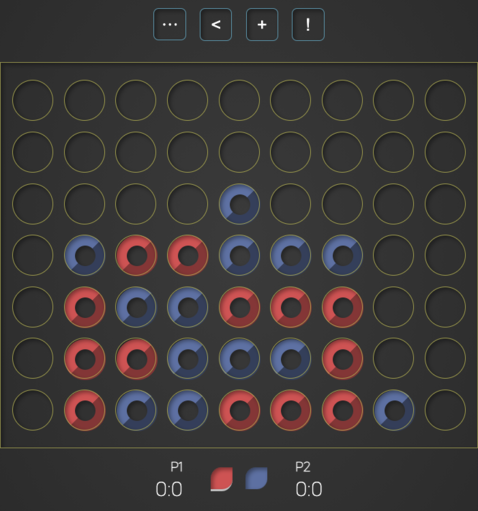

# connect-four #
A design oriented implementation of the connect-four board game in JavaScript

## About ##
This design-oriented implementation of [connect-four](https://en.wikipedia.org/wiki/Connect_Four) seeks to offer a clean/minimal UI along with intuitive UX experience for both PvP (player versus player) and PvC (player versus computer, currently beta) matches. The game offers a significant featureset such as smooth element transisitions, game chip animations, infinite gameplay/scorekeeping, and more.

